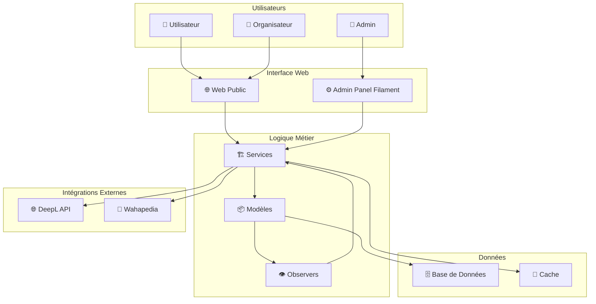
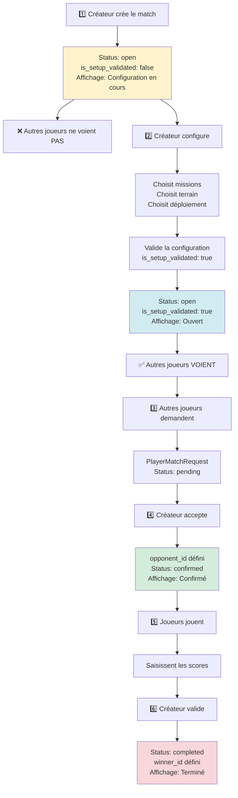
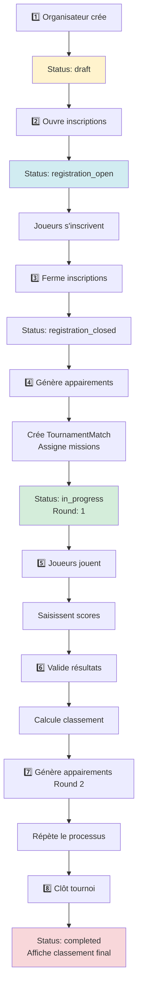
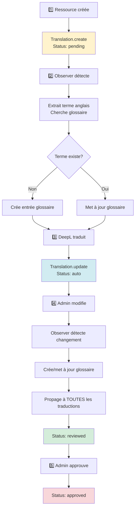
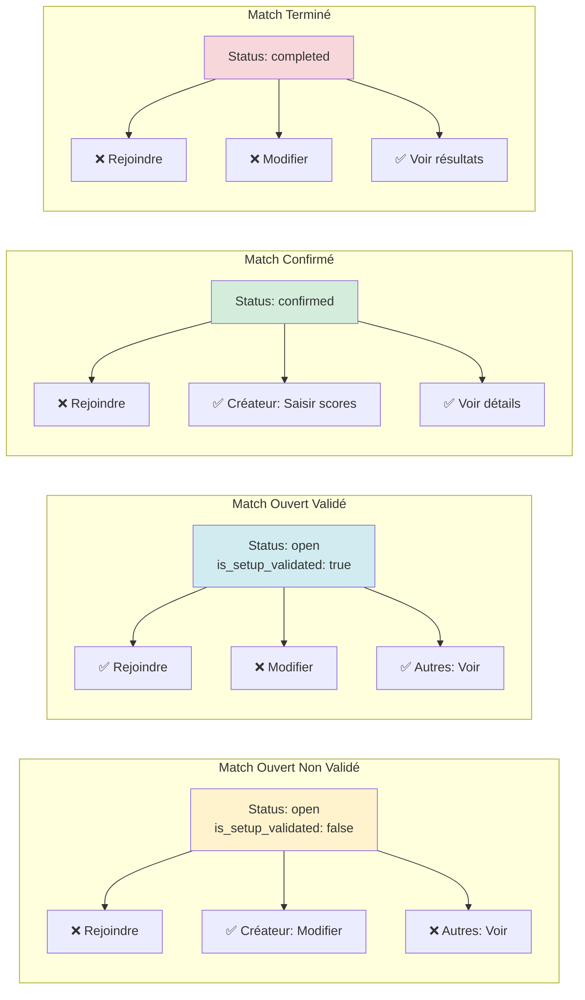
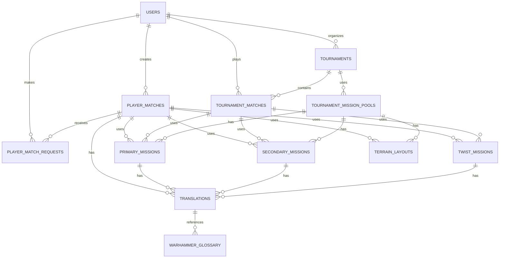
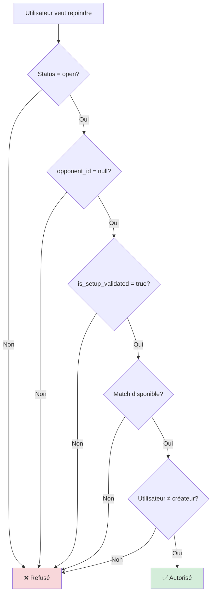
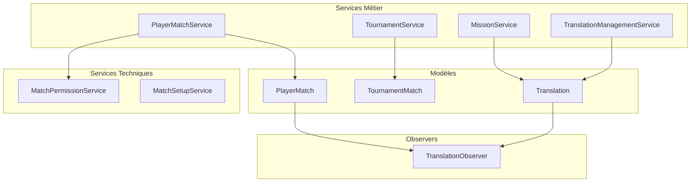
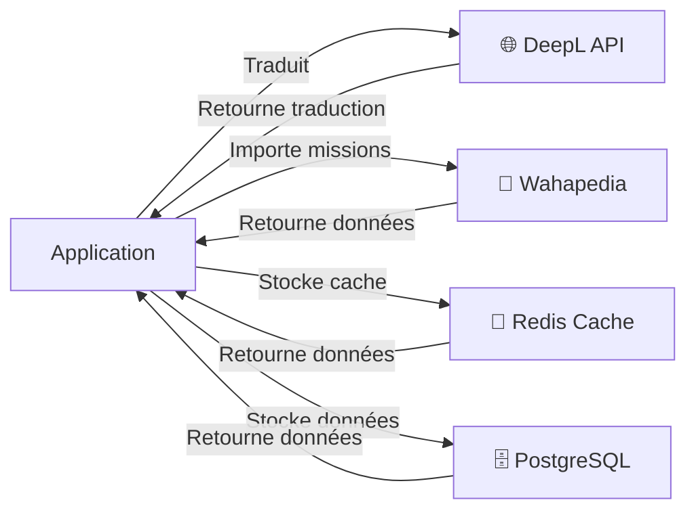

# 📊 DIAGRAMMES VISUELS - ARCHITECTURE ET FLUX

**Date**: 3 novembre 2025
**Format**: Mermaid (compatible GitHub, GitLab, Confluence)

---

## 🏗️ ARCHITECTURE GÉNÉRALE



---

## 🎮 FLUX MATCH JOUEUR COMPLET



---

## 🏆 FLUX TOURNOI COMPLET



---

## 🌍 FLUX TRADUCTION COMPLET



---

## 🔐 MATRICE DE PERMISSIONS



---

## 📊 STRUCTURE DES DONNÉES - RELATIONS



---

## 🔄 CYCLE DE VIE D'UN MATCH JOUEUR

```mermaid
stateDiagram-v2
    [*] --> Open: Créateur crée
    
    Open --> Open: Configuration en cours
    note right of Open
        is_setup_validated = false
        Autres joueurs: ❌ Invisible
    end
    
    Open --> Confirmed: Créateur valide config
    note right of Confirmed
        is_setup_validated = true
        Autres joueurs: ✅ Visible
    end
    
    Confirmed --> Confirmed: Autres joueurs demandent
    
    Confirmed --> Confirmed: Créateur accepte demande
    note right of Confirmed
        opponent_id défini
        Status: confirmed
    end
    
    Confirmed --> Completed: Joueurs jouent et saisissent scores
    
    Completed --> [*]
    note right of Completed
        winner_id défini
        Match archivé
    end
    
    Open --> Cancelled: Créateur annule
    Confirmed --> Cancelled: Créateur annule
    Cancelled --> [*]
```

---

## 🎯 FLUX DE DÉCISION - PEUT REJOINDRE?



---

## 📈 HIÉRARCHIE DES SERVICES



---

## 🔌 INTÉGRATIONS EXTERNES



---

## 📝 RÉSUMÉ DES DIAGRAMMES

- ✅ Architecture générale
- ✅ Flux match joueur (6 étapes)
- ✅ Flux tournoi (8 étapes)
- ✅ Flux traduction (5 étapes)
- ✅ Matrice de permissions
- ✅ Structure des données (ERD)
- ✅ Cycle de vie du match
- ✅ Flux de décision
- ✅ Hiérarchie des Services
- ✅ Intégrations externes

